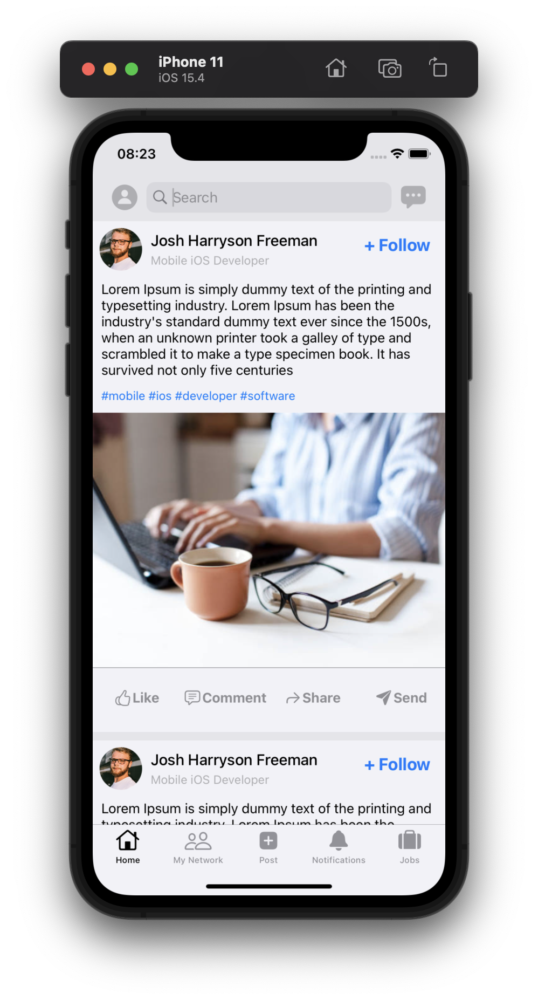
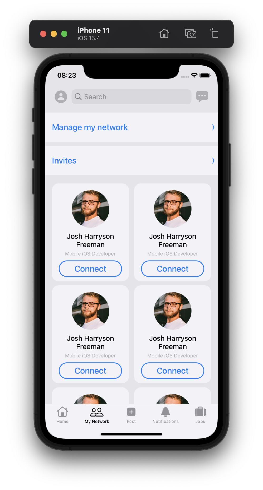
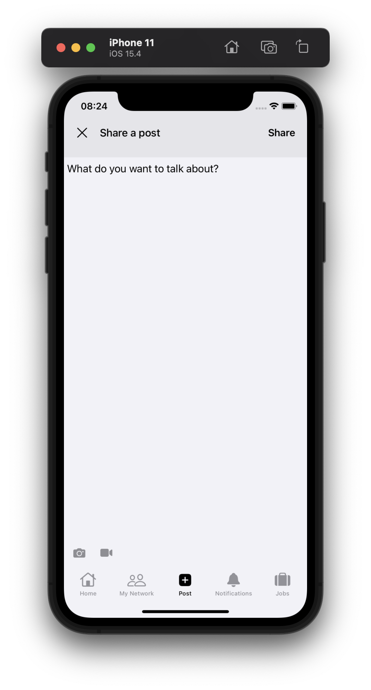
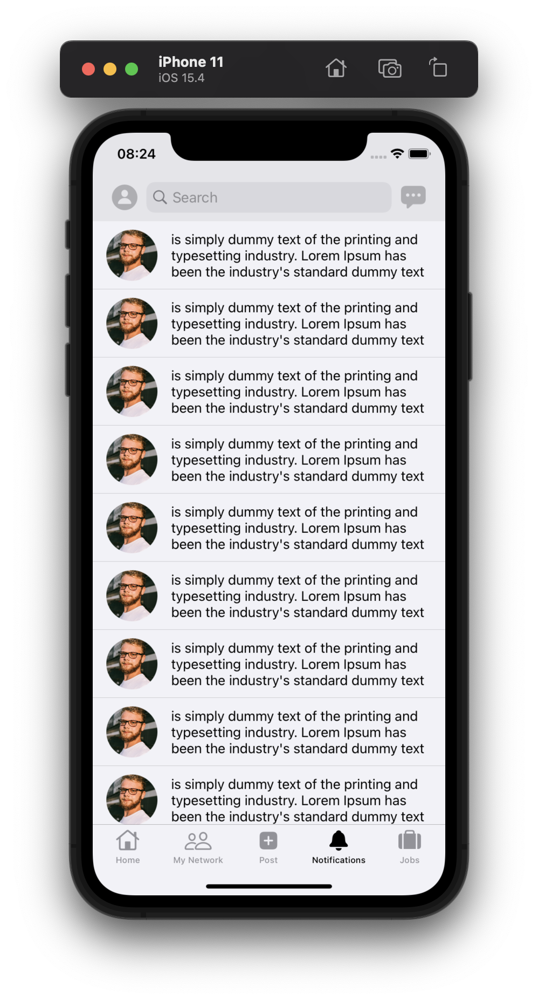
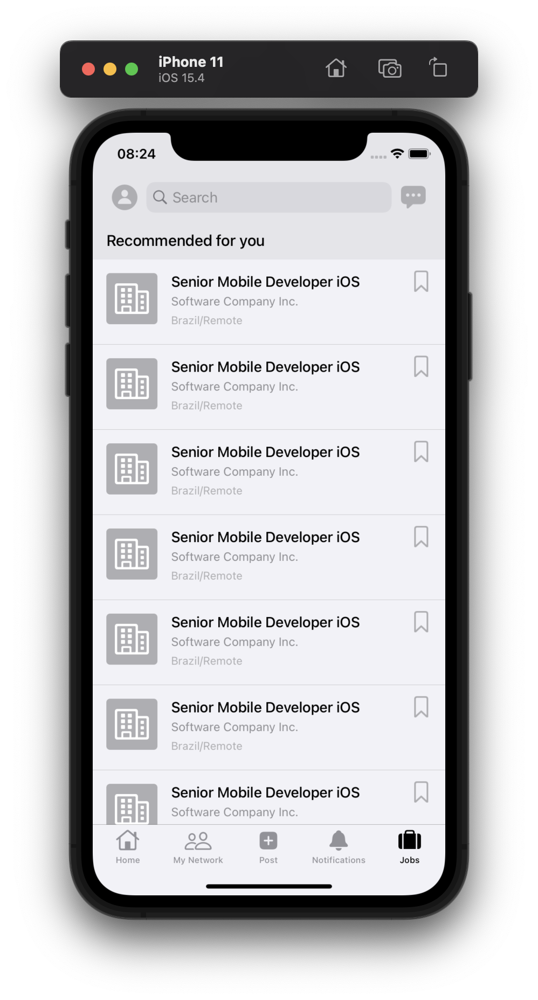
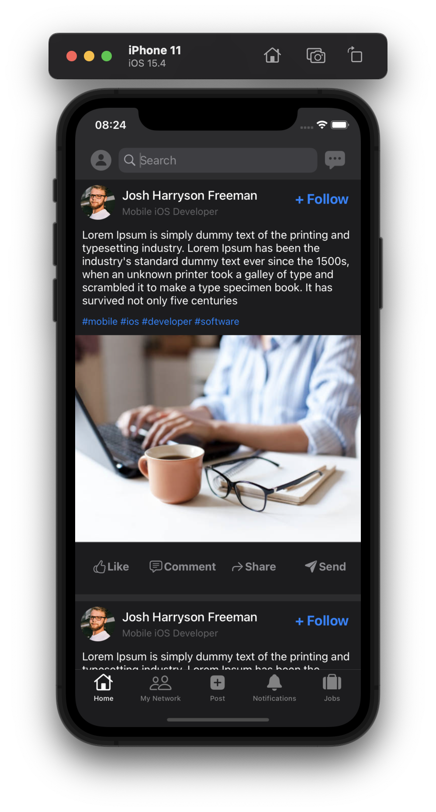
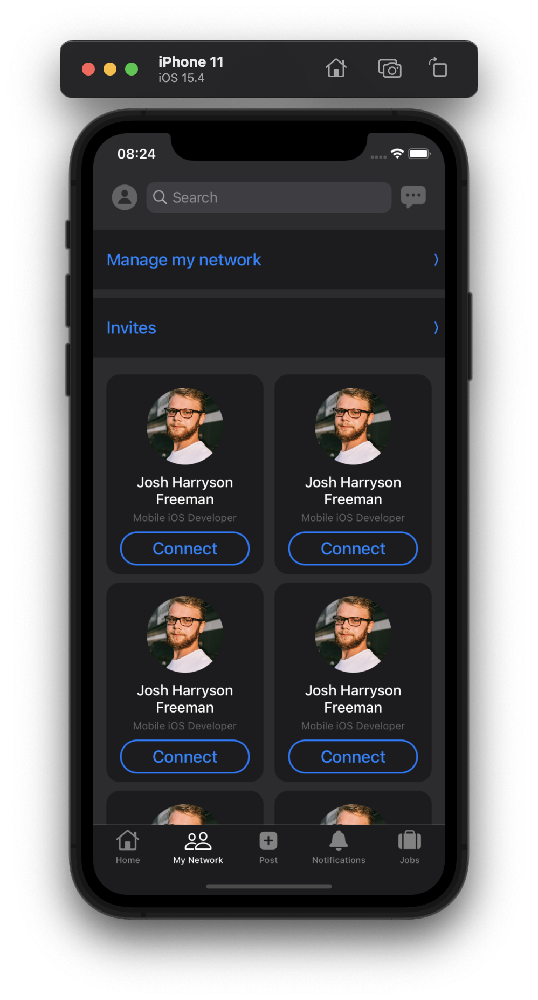
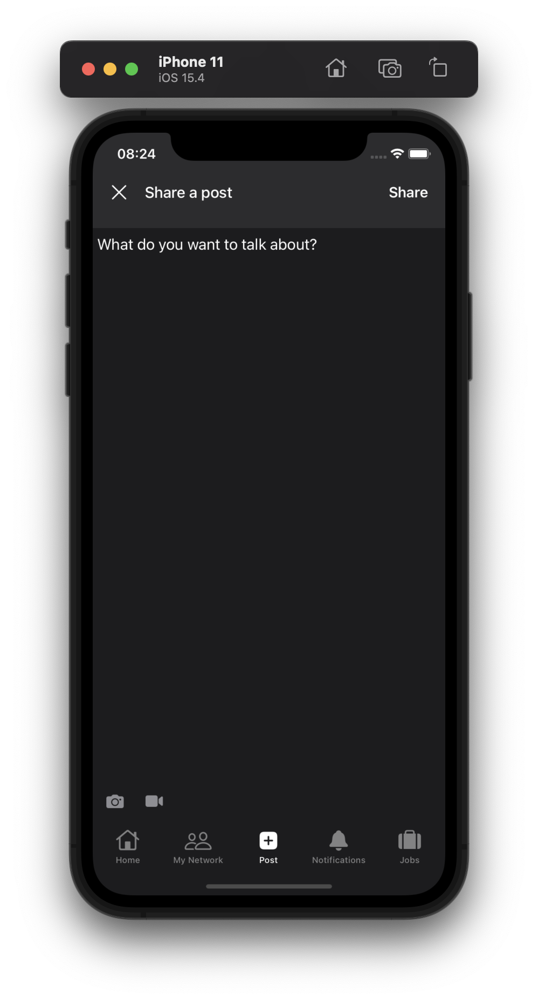
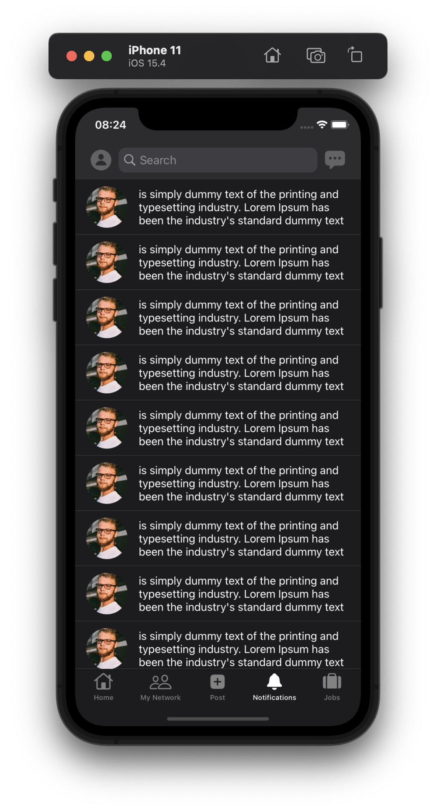
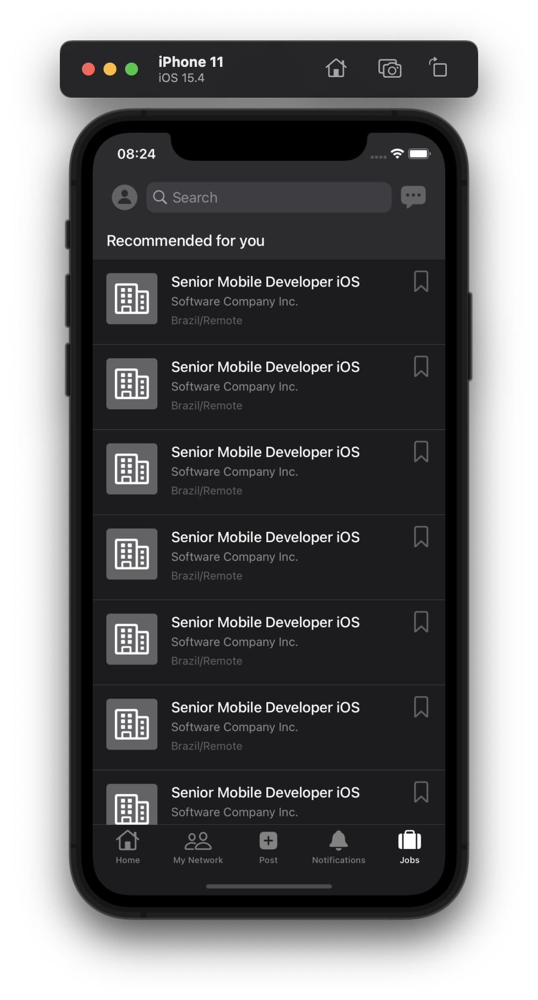

# Linkedin UI Clone

## Light/Dark Mode preview

<table>
  <tbody>
   <tr>
      <td></td>
      <td></td>
      <td></td>
      <td></td>
      <td></td>
    </tr>
    <tr>
      <td></td>
      <td></td>
      <td></td>
      <td></td>
      <td></td>
    </tr>
  </tbody>
</table>

### Made with ###

- Swift
- UIKit and ViewCode
- ViewCode iOS 13 before support
- UITabBarController
- UITableView
- UICollectionView
- AutoLayout and Constraints
- Reusable Components: UILabel
- Light/Dark mode ready
